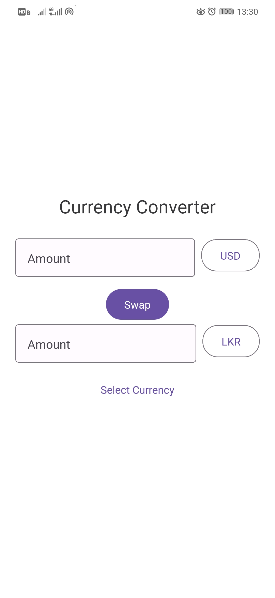
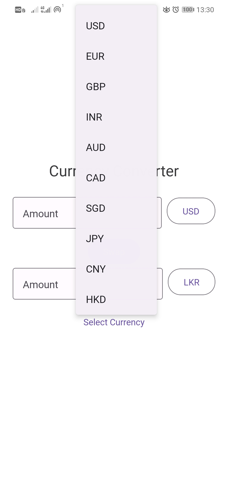
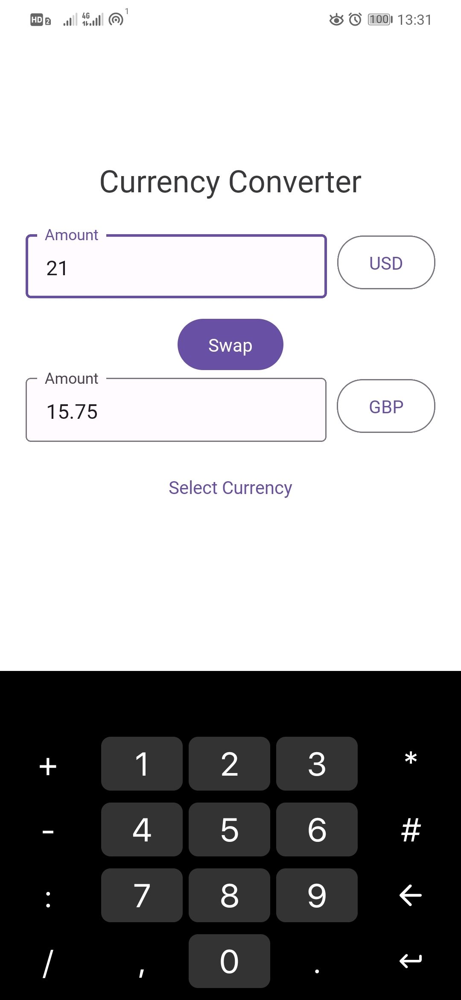
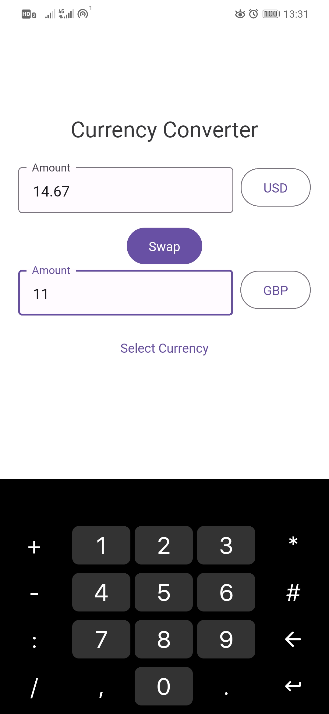
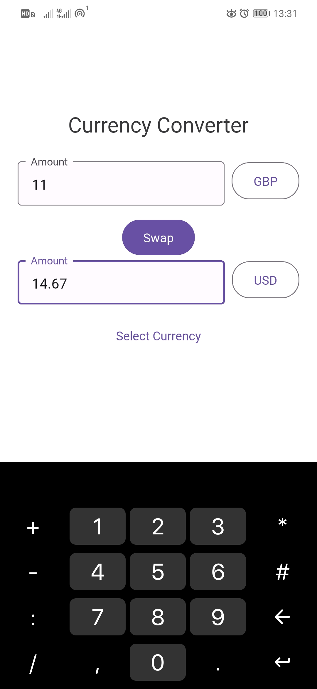

# CurrencyConvo
## A Simple Currency Converter App

A simple currency converter application built using React Native, Expo, and React Native Paper. This app uses mock exchange rates for 20 currencies, including LKR (Sri Lankan Rupee).

## Important Notice

This app uses mock currency rates and includes only 20 currencies. It is not intended for real-world usage.

## Features

- Convert between 20 different currencies.
- Swap between base and target currencies.
- Select currencies from a menu.
- Modular and easy to extend.

## Technologies Used

- React Native
- Expo
- React Native Paper

## Getting Started

### Prerequisites

Ensure you have the following installed:

- [Node.js](https://nodejs.org/)
- [Expo](https://docs.expo.dev/get-started/installation/)

### Installation

1. Clone the repository:

   ```bash
   git clone https://github.com/5yndr0m/CurrencyConvo.git
   cd CurrencyConvo
   ```

2. Install the dependencies:

   ```bash
   npm install
   ```

3. Start the Expo development server:

   ```bash
   expo start
   ```

4. Use the Expo Go app on your mobile device to scan the QR code and run the app.

## Project Structure

```text
CurrencyConverterApp/
├── components/
│   ├── CurrencyConverter.js
│   ├── CurrencyInput.js
│   ├── CurrencyPicker.js
│   ├── ErrorMessage.js
├── services/
│   ├── currencyService.js
├── App.js
```

### Components

- **CurrencyConverter.js**: The main component that handles currency conversion logic.
- **CurrencyInput.js**: A reusable component for currency input fields.
- **CurrencyPicker.js**: A component for selecting currencies from a menu.
- **ErrorMessage.js**: A component to display error messages.

### Services

- **currencyService.js**: A service to fetch mock exchange rates.

## Usage

### Currency Conversion:

1. Enter the amount in the base currency.
2. Select the base and target currencies from the menu.
3. The converted amount will be displayed in the target currency.

### Swap Currencies:

- Use the "Swap" button to swap between the base and target currencies.

## Screenshots

<div style="display: flex; flex-wrap: wrap; gap: 10px;">
  
  
  
  
  
</div>

- **Figure 1**: Home Screen
- **Figure 2**: Currency List
- **Figure 3**: Exchange
- **Figure 4**: Swap 1
- **Figure 5**: Swap 2

## License

This project is licensed under the MIT License.

## Contributing

Contributions are welcome! Please open an issue or submit a pull request for any changes.

## Acknowledgments

- React Native
- Expo
- React Native Paper
